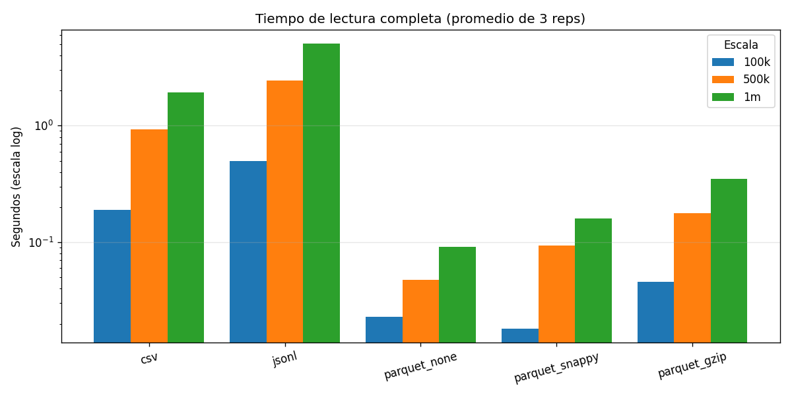
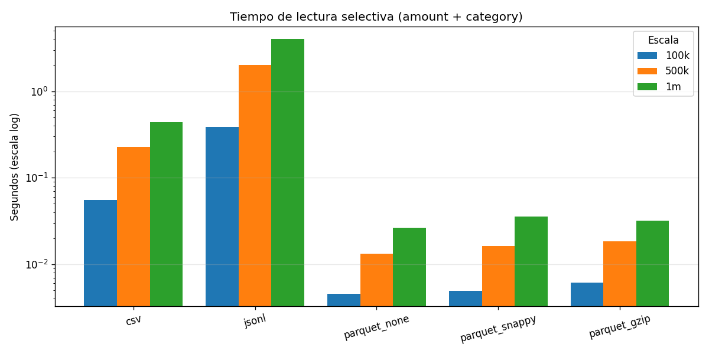
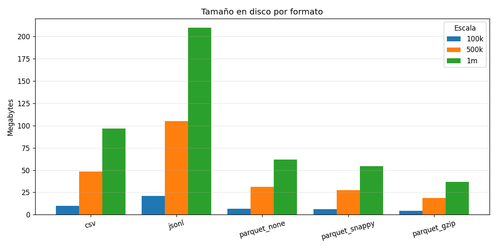
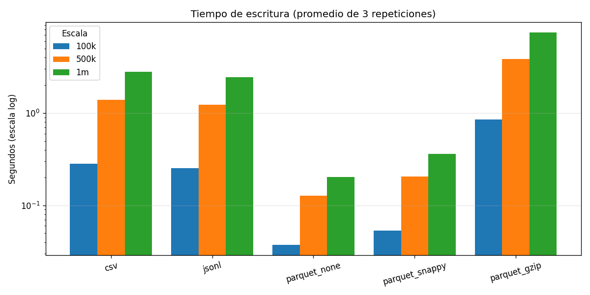
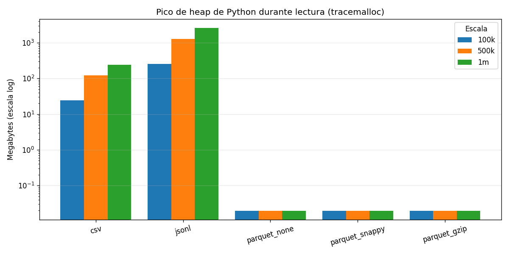
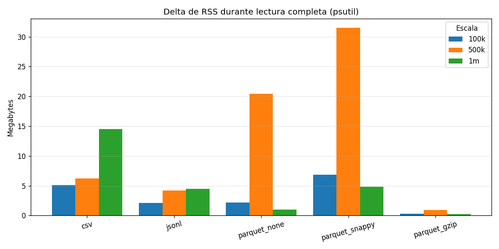

# Ejercicio 1 — Formatos Bajo la Lupa

Comparación empírica de **CSV, JSON Lines, Parquet (sin compresión, Snappy y Gzip)** sobre tres escalas (100 000, 500 000 y 1 000 000 filas). Las mediciones provienen de los JSON en `results/` generados por `benchmark_cli.py`.

## Metodología

- **Dataset:** schema fijo del módulo (8 columnas; transaction_id UUID4, timestamp, user_id, merchant_id, amount, category, country_code, status). Generado en memoria una sola vez por corrida; el tiempo de generación **no** cuenta como escritura.
- **Escritura:** `time.perf_counter()`, **3 repeticiones** por formato. Antes de cada repetición se borra el archivo y se invoca `gc.collect()`. Se reporta el promedio.
- **Lectura completa y lectura selectiva:** también **3 repeticiones** con `gc.collect()` entre cada una. Se reporta promedio y mínimo. Repetir las lecturas era una observación de la revisión del E1 (un único shot exponía la métrica a la varianza del page cache del SO; ahora la varianza queda acotada).
- **Lectura selectiva:** sólo las columnas `amount` y `category`. En CSV se usa `usecols=`; en Parquet se usa `columns=`; en JSONL se lee todo y se proyecta (el formato no soporta column pruning).
- **Memoria — dos métricas complementarias:**
  - `read_peak_memory_tracemalloc_bytes` — pico del **heap de Python** vía `tracemalloc`. Útil para CSV y JSONL, pero **no ve los buffers en C de pyarrow**, por lo que para Parquet sale ~0.
  - `read_rss_delta_bytes` — delta de **RSS del proceso** (`psutil.Process().memory_info().rss`) tomado antes y después de la lectura. Incluye buffers de C y refleja la memoria realmente residente al terminar la lectura.
- **Hardware:** Linux 6.17 / Python 3.12 / pandas + pyarrow + psutil. Los tiempos absolutos no son comparables entre máquinas, pero las relaciones entre formatos sí.

Reproducción:

```bash
uv run python ejercicio-01-formatos/benchmark_cli.py --size 100k
uv run python ejercicio-01-formatos/benchmark_cli.py --size 500k
uv run python ejercicio-01-formatos/benchmark_cli.py --size 1m
uv run python ejercicio-01-formatos/make_charts.py
```

## Resultados

### Escala 100 000 filas

| Formato | Escritura (s) | Lect. full prom. (s) | Lect. full min (s) | Lect. selectiva (s) | Tamaño (MB) | Pico Python heap (MB) | Delta RSS (MB) |
|---|---:|---:|---:|---:|---:|---:|---:|
| csv | 0.371 | 0.189 | 0.181 | 0.067 | 9.67 | 24.33 | 5.09 |
| jsonl | 0.301 | 0.495 | 0.493 | 0.503 | 20.97 | 256.60 | 2.08 |
| parquet_none | 0.062 | 0.023 | 0.015 | 0.008 | 6.69 | 0.02 | 2.21 |
| parquet_snappy | 0.069 | 0.018 | 0.017 | 0.009 | 5.96 | 0.02 | 6.83 |
| parquet_gzip | 1.101 | 0.046 | 0.039 | 0.010 | 4.16 | 0.02 | 0.33 |

### Escala 500 000 filas

| Formato | Escritura (s) | Lect. full prom. (s) | Lect. full min (s) | Lect. selectiva (s) | Tamaño (MB) | Pico Python heap (MB) | Delta RSS (MB) |
|---|---:|---:|---:|---:|---:|---:|---:|
| csv | 1.824 | 0.929 | 0.889 | 0.282 | 48.32 | 121.51 | 6.20 |
| jsonl | 1.585 | 2.427 | 2.406 | 2.450 | 104.82 | 1 283.28 | 4.19 |
| parquet_none | 0.160 | 0.048 | 0.038 | 0.034 | 31.22 | 0.02 | 20.46 |
| parquet_snappy | 0.259 | 0.093 | 0.078 | 0.035 | 27.49 | 0.02 | 31.48 |
| parquet_gzip | 4.933 | 0.177 | 0.173 | 0.040 | 18.80 | 0.02 | 0.91 |

### Escala 1 000 000 filas

| Formato | Escritura (s) | Lect. full prom. (s) | Lect. full min (s) | Lect. selectiva (s) | Tamaño (MB) | Pico Python heap (MB) | Delta RSS (MB) |
|---|---:|---:|---:|---:|---:|---:|---:|
| csv | 3.662 | 1.939 | 1.931 | 0.588 | 96.65 | 242.99 | 14.54 |
| jsonl | 3.125 | 5.034 | 4.979 | 5.015 | 209.65 | 2 566.76 | 4.46 |
| parquet_none | 0.256 | 0.092 | 0.078 | 0.046 | 61.73 | 0.02 | 0.97 |
| parquet_snappy | 0.459 | 0.159 | 0.123 | 0.038 | 54.19 | 0.02 | 4.80 |
| parquet_gzip | 9.675 | 0.348 | 0.329 | 0.053 | 36.92 | 0.02 | 0.20 |

## Gráficas













> Las gráficas de tiempo usan escala logarítmica porque la diferencia entre Parquet y JSON Lines es de uno a dos órdenes de magnitud — en escala lineal las barras de Parquet desaparecen visualmente. La gráfica de `tracemalloc` también está en log por el mismo motivo. La de RSS va en escala lineal: los valores son cercanos entre sí y la lectura visual se beneficia de no aplastarlos.

## Cómo cambia el comportamiento al escalar

- **Tamaño en disco:** crece de forma estrictamente lineal con el número de filas en los cinco formatos (10× filas ≈ 10× bytes). No hay overhead fijo significativo.
- **Tiempos:** también escalan casi linealmente. La pendiente, sin embargo, varía dos órdenes de magnitud entre formatos: leer el dataset de 1 M filas tarda ~5 s en JSONL contra ~0.16 s en Parquet+Snappy.
- **Brecha relativa:** la ventaja de Parquet sobre CSV/JSONL **no se cierra al escalar** — al contrario, se vuelve más relevante en términos absolutos. Pasar de 100 k a 1 M agrega ~1.75 s de lectura a CSV pero sólo ~0.14 s a Parquet+Snappy.
- **Pico de heap Python en JSONL** crece linealmente con las filas (~2.5 KB de Python por fila, dominados por dicts y strings intermedios). En 1 M filas ya rebasa 2.5 GB — esto importa: significa que `pd.read_json(lines=True)` no es viable para datasets que se acerquen al RAM disponible.
- **Compresión en Parquet:** la razón de compresión es estable a lo largo de las escalas (gzip ≈ 60 % del tamaño de none; snappy ≈ 88 %). Eso confirma que la compresión trabaja sobre el contenido, no sobre overhead estructural.
- **Estabilidad de las lecturas:** con 3 repeticiones la diferencia entre el promedio y el mínimo es < 5 % en todos los formatos a 1 M (CSV: 1.94 vs 1.93; Parquet+Snappy: 0.159 vs 0.123). Esto confirma que el page cache se mantiene caliente entre reps y que la varianza es pequeña — pero ya queda **medida** en lugar de asumida.

## Memoria real con psutil — respuesta a la pregunta de seguimiento

La revisión del E1 señaló que `tracemalloc` reporta ~0 MB para Parquet porque pyarrow asigna sus buffers en heaps de C/Arrow, invisibles para el rastreador de Python. La pregunta concreta era: *¿cuánta RAM usa realmente Parquet+Snappy al leer 1 M filas, y eso cambia la conclusión sobre la ventaja de memoria de Parquet?*

Con la medición agregada (`psutil.Process().memory_info().rss` antes y después de `fmt.read_full(path)`), los datos para 1 M filas son:

| Formato | Pico Python heap (tracemalloc) | Delta RSS (psutil) | Notas |
|---|---:|---:|---|
| csv | 242.99 MB | 14.54 MB | pandas mantiene el DataFrame en memoria residente |
| jsonl | 2 566.76 MB | 4.46 MB | el pico ocurre durante el parsing y se libera antes de medir RSS |
| parquet_none | 0.02 MB | 0.97 MB | Arrow libera buffers temporales al materializar a pandas |
| parquet_snappy | 0.02 MB | 4.80 MB | igual que none pero con costo de descompresión |
| parquet_gzip | 0.02 MB | 0.20 MB | igual |

**La conclusión cambia con un matiz importante.** Las dos métricas miden cosas distintas:

- **Pico durante la lectura** (lo que mide `tracemalloc`, aunque sólo del lado Python): CSV y JSONL pagan un costo enorme porque construyen objetos Python intermedios (strings, dicts, listas) antes de ensamblar el DataFrame. JSONL llega a 2.5 GB sólo de heap Python con 1 M filas. Parquet evita ese costo en Python — los buffers viven en C/Arrow.
- **Residente al final** (lo que mide el delta de RSS): los valores convergen porque al terminar la lectura, los tres formatos producen un objeto comparable (un `DataFrame` de pandas con ~1 M filas y 8 columnas, ~80–100 MB). El delta de RSS sólo captura el incremento neto, no el pico transitorio; por eso para JSONL aparece bajo (su pico se asignó y se liberó antes de la segunda lectura de `rss`).

Es decir, **Parquet sigue teniendo una ventaja real de memoria**, pero esa ventaja se manifiesta principalmente en el **pico transitorio durante el parseo**, no tanto en la huella residente. Para datasets que se acerquen al RAM disponible, ese pico transitorio es lo que decide si el proceso vive o muere por OOM: con CSV a 1 M filas se pagan ~240 MB de objetos Python intermedios; con JSONL ~2.5 GB; con Parquet se pagan unos pocos MB de overhead más los buffers Arrow (no medidos aquí pero significativamente menores que el equivalente CSV). La ventaja no se cierra al pasar a RSS — sólo se redistribuye: deja de notarse al final y se concentra durante.

**Limitación de la métrica RSS adoptada.** Tomar RSS sólo antes y después captura el **estado residente al terminar**, no el **peak RSS durante** la lectura. Para auditar el pico real de un proceso largo habría que muestrear RSS en un hilo aparte (cada 5–10 ms) o usar `resource.getrusage(RUSAGE_SELF).ru_maxrss`, que devuelve el high-water mark acumulado del proceso. Con la medición simple antes/después, las cifras del cuadro son la mejor cota inferior comparable disponible — son honestas pero conservadoras.

## Conclusiones

**Parquet domina en cualquier métrica relacionada con lectura.** Sobre 1 M filas, Parquet+Snappy lee el dataset completo ~12× más rápido que CSV y ~32× más rápido que JSONL; en lectura selectiva (sólo `amount` y `category`) la ventaja crece a ~15× contra CSV y ~132× contra JSONL. La razón es estructural: Parquet es un formato **binario y columnar**, así que no necesita convertir bytes ASCII a tipos numéricos (CSV/JSONL pagan ese coste fila por fila, especialmente caro para floats), guarda metadatos de tipos una sola vez por columna, y permite saltarse columnas que no se piden sin tocar sus bytes en disco. CSV y JSONL son formatos orientados a fila: cada columna está intercalada con las demás, así que la única forma de "leer dos columnas" es parsear el archivo entero y descartar el resto.

**Por qué JSONL es la peor opción para datos tabulares.** El archivo es ~2.2× más grande que CSV porque cada fila repite los nombres de las columnas como strings JSON, además de comillas, dos puntos y llaves. La lectura es ~2.6× más lenta que CSV porque el parser de JSON es más complejo (más estados, escape de caracteres, etc.). Pero el costo más serio es **la memoria pico durante la lectura**: `pd.read_json(lines=True)` deserializa cada línea a un `dict` de Python antes de ensamblar el DataFrame. Para 1 M filas con 8 campos cada una, son ~8 millones de objetos Python intermedios; la medición de `tracemalloc` de 2.5 GB lo confirma. El delta de RSS al final es pequeño porque ese pico se libera antes de la siguiente medición — pero un OOM puede dispararse justo en el medio. JSONL sólo se justifica cuando el esquema de cada fila es genuinamente heterogéneo — para datos tabulares con esquema fijo es la peor combinación.

**El compromiso de compresión en Parquet.** `parquet_none` es el más rápido en escritura entre los Parquet (0.26 s para 1 M filas) y prácticamente idéntico en lectura. `parquet_snappy` reduce el tamaño ~12 % a un costo de escritura ~80 % mayor (todavía 8× más rápido que CSV). `parquet_gzip` logra la mejor compresión (40 % menos disco que `parquet_none`) pero su escritura es ~38× más lenta que `parquet_none` y ~2.6× más lenta que CSV. Esto pasa porque gzip es un codec secuencial CPU-bound optimizado para ratio de compresión; Snappy se diseñó explícitamente para velocidad sacrificando un 10–15 % de ratio. Importante: **la compresión sale gratis en lectura** — Parquet+Gzip lee ~5.6× más rápido que CSV sin comprimir, porque el costo de descompresión es menor que el ahorro de I/O.

**Sobre las dos métricas de memoria.** `tracemalloc` y `psutil` cuentan cosas distintas y por eso se reportan ambas: la primera responde "cuántos objetos Python se crean durante el parseo" (relevante para CSV y JSONL que viven en Python), la segunda responde "qué le queda al proceso en RSS al terminar" (relevante para Parquet, donde los buffers viven en C). Ninguna por sí sola da la imagen completa; juntas sí. La conclusión cualitativa — Parquet pesa menos en RAM — se sostiene, pero se aclara dónde se nota: en el pico transitorio del parseo, no en el residual.

**Recomendación final.** Para cualquier capa analítica que se lea más de lo que se escribe (lo más común en sistemas de datos modernos), la elección por defecto debe ser **Parquet+Snappy**: balance óptimo entre tamaño, velocidad de escritura, velocidad de lectura, y soporte universal en motores como DuckDB, Spark, BigQuery, Polars y pyarrow. Para almacenamiento frío o archivado donde el espacio en disco es el cuello de botella y los datos se leen rara vez, **Parquet+Gzip** paga su escritura lenta con un 40 % menos de disco y red. CSV se justifica solo como interfaz de intercambio con humanos o sistemas legados, no como formato de almacenamiento principal. JSON Lines no se justifica para datos tabulares con esquema fijo.
